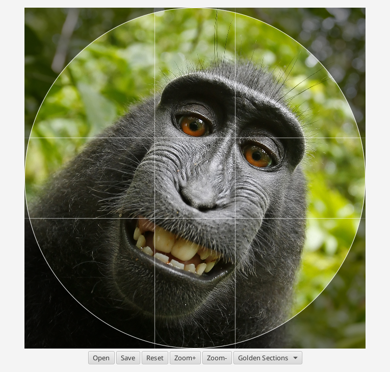

# pfpcrop

A simple profile picture cropper.

## Instructions

### with OpenJDK 17

Run the application:

    mvn javafx:run

Build an überjar:

    mvn package

Build a custom runtime image:

    mvn javafx:jlink

Build a native package:

    mvn javafx:jlink jpackage:jpackage

### with GraalVM + GluonFX

Run the application on JVM/HotSpot:

    mvn gluonfx:run

Build a native image:

    mvn gluonfx:build

### with GraalVM + GluonFX + tools.build

Build a native image using:

    clojure -T:build native

Building a GraalVM native image with Clojure's tools.build *possibly*
works on GraalVM CE 21.3.0 Java 11, but it doesn't work as well as
building with gluonfx-maven-plugin.

## License

Copyright © 2022 Noodles!

Distributed under the ISC License.
